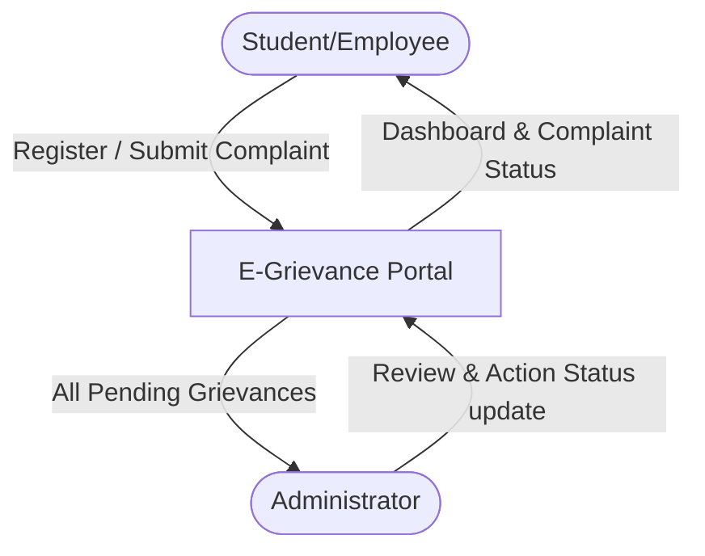
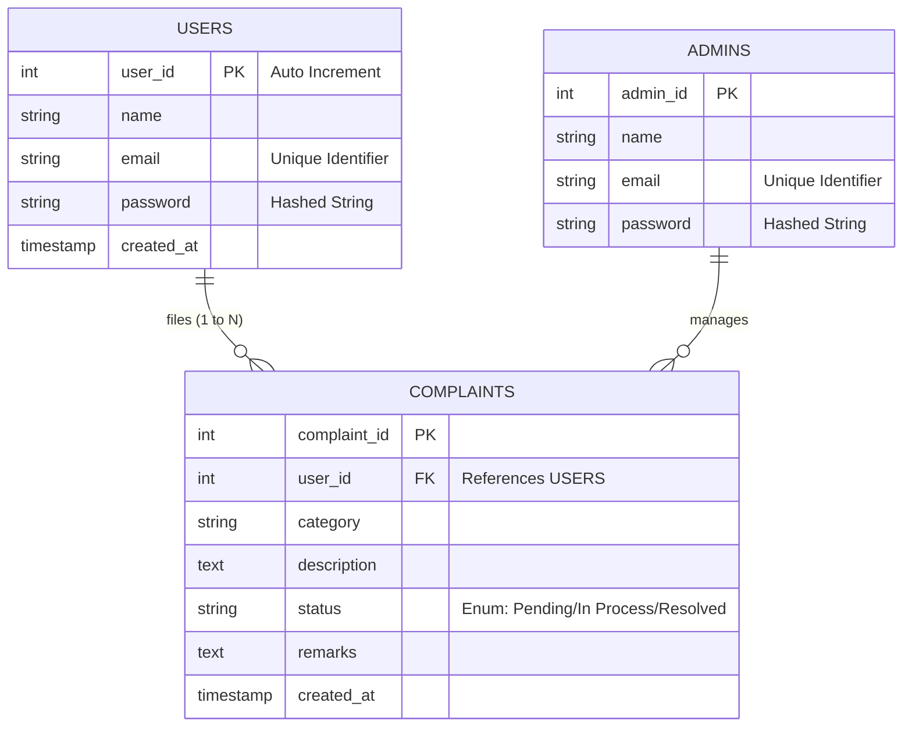

# 🔥 Final Project Report: E-Grievance Portal 🔥
**Course:** BCA | **Technology:** Python, Flask, MySQL, Bootstrap

## 1. Software Requirements Specification (SRS)
### 1.1 Purpose
The purpose of the E-Grievance Portal is to provide a transparent, efficient, and centralized digital platform for students and employees to register academic/infrastructure complaints and for administrators to systematically manage and resolve them.

### 1.2 Tech Stack Chosen
- **Frontend View**: HTML5, CSS3, Bootstrap 5, Jinja2
- **Backend Controller**: Python 3.x, Flask Web Framework
- **Database Model**: MySQL DB
- **Security Elements**: Werkzeug Password Hashing (`pbkdf2:sha256`), Environment Variables

### 1.3 Feasibility Study
- **Technical Feasibility:** Python and MySQL are robust, open-source technologies capable of handling web traffic securely.
- **Operational Feasibility:** Replaces a slow, paper-based manual grievance book with an instant digital tracking system.
- **Economic Feasibility:** Highly viable as the entire infrastructure relies on free, open-source tech stacks.

---

## 2. SDLC (Software Development Life Cycle) Model
We followed the **Agile & Incremental Methodology** to build the software step-by-step:
1. **Planning:** Analyzing folder structure and dependencies (Requirements.txt)
2. **Design:** Designing MySQL Schema & normalized table structures
3. **Backend Logic:** Creating Flask routing, authentication & hashing
4. **UI Development:** Developing responsive templates with Bootstrap 5
5. **Integration:** Wiring HTML forms via POST methods to Python APIs
6. **Testing:** Unit test scripts and integration verification
7. **Production:** Readiness for XAMPP/Cloud execution

---

## 3. Project Architecture Diagrams

### 3.1 Data Flow Diagram (DFD) - Level 0

### 3.2 Entity Relationship (ER) Diagram

---

## 4. Software Testing Overview
The system was verified using a hybrid testing approach:
- **Unit Testing:** `test_app.py` script validates fundamental Python functionality with HTTP 200/302 assertions.
- **Manual Testing:** Exhaustively documented in `test_cases.md` table.

## 5. Conclusion
This project successfully serves as a fully-blown prototype of a college grievance management solution mapping directly to university SDLC guidelines.
